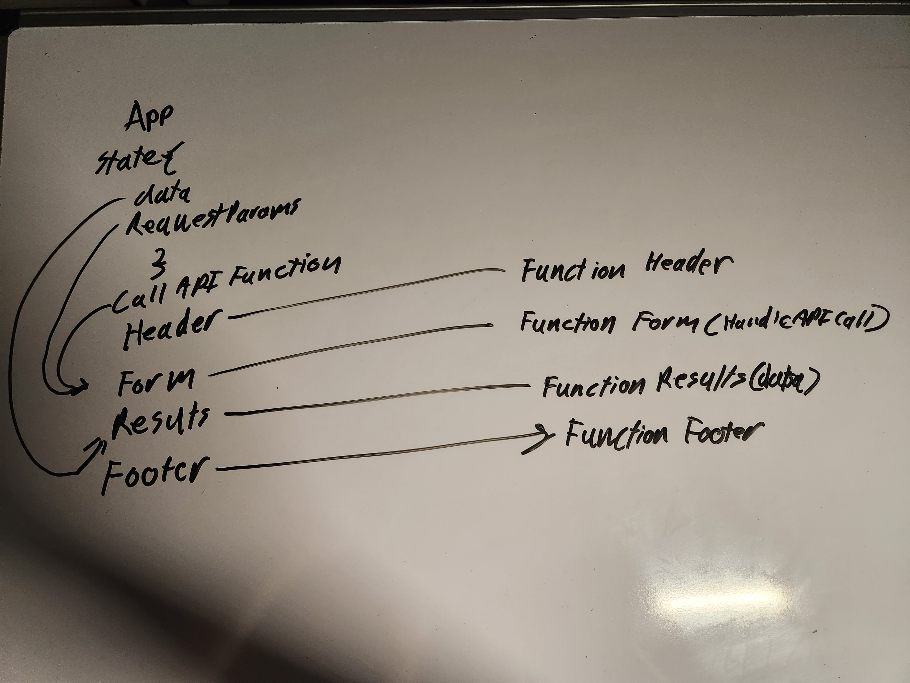

# resty  

## Lab 26

## UML  

  

## Approach  

Functionalized all children components of app.js and added scss for all the components. The app still functions as it did originally.  

## Lab 27  

## Approach  

Changed all uses of class based state to use the hook useState. Also made the form actually take in a url, and display it afterwards. Wrote a test that can confirm this.
